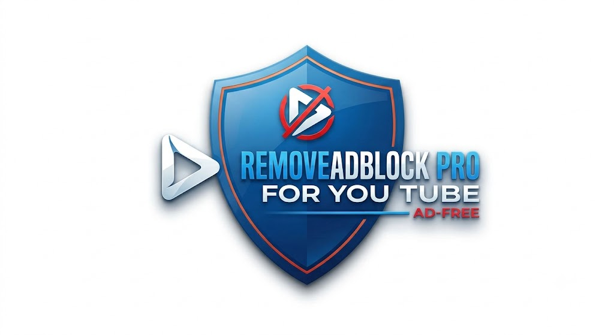

# 🛡️ **REMOVEADBLOCK PRO**
**Trình Chặn Quảng Cáo YouTube - Phiên Bản 14.9.12**

> Trình chặn quảng cáo YouTube cao cấp sử dụng công nghệ **Tiêm Tàng Hình (Stealth Injection)** kết hợp Hệ thống Khôi phục Thông minh Thích ứng.

---

### 🎥 **Demo trên YouTube**

---

## ✨ TÍNH NĂNG CỐT LÕI

- **Loại bỏ quảng cáo triệt để**: Xóa sạch pre-roll, mid-roll, overlay, banner và toàn bộ nội dung tài trợ
- **Tiêu diệt Enforcement**: Tự động loại bỏ hộp thoại “Continue Watching”, “Ad blocker detected” và mọi thông báo enforcement
- **Tự động Skip & Tăng tốc thông minh**: Tua nhanh và bỏ qua quảng cáo tức thì với thuật toán thông minh
- **Khôi phục Stream Khẩn cấp**: Tự động phục hồi phát video khi YouTube cố gắng chặn
- **Bảo vệ Tương tác Phần cứng**: Giám sát click thật, phím Space và phím K để phân biệt thao tác người dùng thực
- **Hiệu suất cao**: Nhẹ, không làm chậm trình duyệt
- **Cập nhật thích ứng**: Tự động thích nghi với mọi thay đổi giao diện của YouTube

---

## 🧠 THUẬT TOÁN ĐA TẦNG

Trái tim của **RemoveAdblock Pro** là hệ thống phòng thủ thông minh đa lớp:

**Core Engine = (Stealth Injection + JSON Proxy) × Recovery System × Anti-Detection**

### Các lớp công nghệ:

- **Main World Injection**: Tiêm script trực tiếp vào ngữ cảnh JavaScript chính của trang (bỏ qua giới hạn content script thông thường)
- **JSON Proxy Manipulation**: Can thiệp sâu theo thời gian thực vào `playerResponse` và `ytplayer.config`
- **Hardware Tracker**: Phát hiện tương tác vật lý thật từ người dùng
- **Network Interceptor**: Chặn hoàn toàn các request theo dõi & báo cáo của YouTube
- **Nonstop Recovery Engine**: Giám sát liên tục và tự động khôi phục video
- **Stealth CSS + DOM Observer**: Ẩn triệt để mọi phần tử quảng cáo bằng CSS và theo dõi DOM

---

## 🎯 CÁC CƠ CHẾ BẢO VỆ QUAN TRỌNG

| Lớp | Tên Cơ Chế              | Mô Tả                                      |
|-----|-------------------------|--------------------------------------------|
| 1   | **Stealth Injection**   | Tiêm script tàng hình trực tiếp vào Main World |
| 2   | **JSON Proxy**          | Thao túng dữ liệu player theo thời gian thực |
| 3   | **Hardware Tracker**    | Giám sát tương tác thật của người dùng     |
| 4   | **Nonstop Recovery**    | Tự động khôi phục stream khi bị gián đoạn  |
| 5   | **Anti-Detection**      | Chống lại cơ chế phát hiện adblock của YouTube |

---

## 📥 HƯỚNG DẪN CÀI ĐẶT

1. Tải mã nguồn extension về máy (folder hoặc file zip)
2. Mở trình duyệt (**Chrome / Edge / Brave**)
3. Truy cập `chrome://extensions/` hoặc `edge://extensions/`
4. Bật **Developer Mode**
5. Nhấn **"Load unpacked"** → Chọn thư mục chứa extension
6. Hoàn tất! Extension sẽ hoạt động ngay lập tức

---

## ⚙️ PHÁT TRIỂN & KIẾN TRÚC

- **Ngôn ngữ**: JavaScript thuần, tiêm trực tiếp vào YouTube
- **Công nghệ chính**: Proxy, MutationObserver, RequestAnimationFrame, Network Interception
- **Mục tiêu**: Mang lại trải nghiệm YouTube **sạch – mượt – không gián đoạn**

---

## 🔧 LIÊN HỆ & HỖ TRỢ

- **Tác giả:** Thái Thông  
- **Email:** [ThaiThongsj@gmail.com](mailto:ThaiThongsj@gmail.com)

### 💰 Ủng hộ dự án

**Tài khoản Vietcombank**  
`9898661918` — **NGUYỄN NGỌC THÁI THÔNG**

---

**Cảm ơn bạn đã sử dụng RemoveAdblock Pro!**  
Chúc bạn xem YouTube thoải mái, không còn bị làm phiền bởi quảng cáo. ✨

---

**Made with ❤️ for a better viewing experience**
